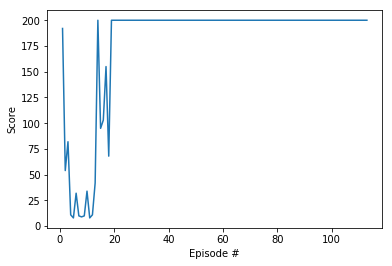

# OpenAI 机器人强化学习从入门到提高 **(草稿)**

> 除了试图直接去建立一个可以模拟成人大脑的程序之外， 为什么不试图建立一个可以模拟小孩大脑的程序呢?如果它接 受适当的教育，就会获得成人的大脑。 — 阿兰·图灵

## 学习目的

- 理论和仿真实践结合
- 了解掌握强化学习基本原理
- 掌握利用 Python 进行强化学习仿真

## 一. 引言介绍

强化学习 (Reinforcement learning) 是机器学习的一个子领域用于制定决策和运动自由度控制。强化学习主要研究在复杂未知的环境中，智体(agent)实现某个目标。强化学习最引人入胜的两个特点是

- **强化学习非常通用，可以用来解决需要作出一些列决策的所有问题：**例如，训练机器人跑步和弹跳，制定商品价格和库存管理，玩 Atari 游戏和棋盘游戏等等。

- **强化学习已经可以在许多复杂的环境中取得较好的实验结果：**例如 Deep RL 的 Alpha Go等

[Gym](https://gym.openai.com/docs/) 是一个研究和开发强化学习相关算法的仿真平台。

- 无需智体先验知识；
- 兼容常见的数值运算库如 TensorFlow、Theano 等

## 二. 强化学习的基本概念

强化学习也是机器学习中的一个重要分支。强化学习和监督学习的不同在 于，强化学习问题不需要给出“正确”策略作为监督信息，只需要给出策略的(延迟)回报，并通过调整策略来取得最大化的期望回报。


### 2.1 术语

- 智体 (Agent): 执行动作对环境产生影响，感知外接环境状态(state)和反馈奖励(reward)，并进行学习和决策。
- 环境 (Environment)： 出了智体以外的所有事物，智体动作可以影响环境状态，反馈智体奖励。
- 状态 $s$ (State)：是环境的描述。
- 动作 $a$ (Action)：对智体行为的描述。
- 策略 $\pi$ (Policy)：智体根据环境的状态来决定下一步动作$a$的函数。
- 奖励 $r$ (Reward)：当智体完成动作之后，环境会响应的给智体一个奖励(标量值)$r$。
- 状态转移概率 ：智体从前一个状态完成动作后，环境在下个时间点转变成状态s的概率

### 2.2 马尔科夫过决策过程

#### 原理图


#### 解释

- 智能体与环境的交互的过程可以看作是一个**马尔可夫决策过程**。马尔可夫过程(Markov process)是具有马尔可夫性的随机变量序列$s_0,s_1,...,s_t$ 下一个时刻的状态 $s_{t+1}$ 只取决于当前时刻的 $s_{t}$ 

$$p\left(s_{t+1} \mid s_t,...,s_0 \right) = p\left(s_{t+1} \mid s_{t}\right)$$

- 给定策略$\pi\left(a\mid s\right)$，轨迹

$$\tau = s_0,a_0,s_1,r_1,a_1,...,s_{T-1},s_T,r_T$$

### 强化学习优化的目标函数

- 总回报，折扣率 $\gamma \in \left[0,1\right]$

$$G_{T}=\sum_{t=0}^{T-1}\gamma ^{t} r_{t+1}$$

- 目标函数

$$J\left( \theta \right) = E\left[G\left(\tau \right)\right]$$

## 三. OpenAI 强化学习仿真环境

- A standard Python API for RL environments
- A set of tools to measure agent performance
- An online scoreboard for comparing and benchmarking approaches
- [ https://gym.openai.com/](https://gym.openai.com/)

### 3.1 环境安装

- pip 安装  
    ```
    pip3 install gym
    ```
- 源码安装  
    ```shell
    git clone https://github.com/openai/gym.git
    cd gym
    pip install -e .
    ```
- 验证安装是否成功


```python
import gym
env = gym.make('Copy-v0')
env.reset()
env.render()

```

    Total length of input instance: 3, step: 0
    ==========================================
    Observation Tape    :   DBC  
    Output Tape         :   
    Targets             :   DBC  
    
    
    
    
    
    


    <ipykernel.iostream.OutStream at 0x1043684e0>


### 3.2 OpenAI 术语解释

- **观测** Observation (Object)：当前 step 执行后，环境的观测(类型为对象)。例如，从相机获取的像素点，机器人各个关节的角度或棋盘游戏当前的状态等；

- **奖励** Reward (Float): 执行上一步动作(action)后，智体(agent)获得的奖励(浮点类型)，不同的环境中奖励值变化范围也不相同，但是强化学习的目标就是使得总奖励值最大；

- **完成** Done (Boolen): 表示是否需要将环境重置 `env.reset`。大多数情况下，当 `Done` 为 `True` 时，就表明当前回合(episode)或者试验(tial)结束。例如当机器人摔倒或者掉出台面，就应当终止当前回合进行重置(reset);

- **信息** Info (Dict): 针对调试过程的诊断信息。在标准的智体仿真评估当中不会使用到这个 info，具体用到的时候再说。


总结来说，这就是一个强化学习的基本流程，在每个时间点上，智体执行 action，环境返回上一次 action 的观测和奖励，用图表示为

## 四. 第一个强化学习 Hello World

### 车杆模型


```python
import gym
env = gym.make('CartPole-v0')
init_state = env.reset()
print('init state = ', init_state)
for _ in range(1000):
    env.render()
    action = env.action_space.sample()
    observation, reward, done, info = env.step(action) # take a random action
    if done: 
        env.render()
        break
```

    WARN: gym.spaces.Box autodetected dtype as <class 'numpy.float32'>. Please provide explicit dtype.
    init state =  [ 0.03829178 -0.01427857 -0.00701367  0.00567602]


### 概念解读

- 创建实例
    - 每个 Gym 环境都有唯一的命名，命名方式为 `([A-Za-z0-9]+-)v([0-9]+)`
    - 使用 `gym.make('CartPole-v0')` 创建环境

- 重置函数 reset
    - 用于重新开启一个新的回合(试验)
    - 返回回合的初始状态

- 执行(step)
    - 执行特定的动作，返回状态(state)
    - observation, reward, done, info
    
- 渲染(render)
    - 用于显示当前环境的状态
    - 用于调试和定性的分析不同策略的效果

### 空间(space)


```python
import gym
env = gym.make('CartPole-v0')
print(env.action_space)
#> Discrete(2)
print(env.observation_space)
#> Box(4,)

print(env.observation_space.high)
print(env.observation_space.low)
```

    WARN: gym.spaces.Box autodetected dtype as <class 'numpy.float32'>. Please provide explicit dtype.
    Discrete(2)
    Box(4,)
    [4.8000002e+00 3.4028235e+38 4.1887903e-01 3.4028235e+38]
    [-4.8000002e+00 -3.4028235e+38 -4.1887903e-01 -3.4028235e+38]


- 观测空间 `observation_space` 是一个 `Box` 类型，从 [box.py](https://github.com/openai/gym/blob/master/gym/spaces/box.py) 源码可知，表示一个 `n` 维的盒子，所以在上一节打印出来的 `observation` 是一个长度为 4 的数组。数组中的每个元素都具有上下界。

    - Type: Box(4)

Num | Observation | Min | Max
---|---|---|---
0 | Cart Position | -2.4 | 2.4
1 | Cart Velocity | -Inf | Inf
2 | Pole Angle | ~ -41.8&deg; | ~ 41.8&deg;
3 | Pole Velocity At Tip | -Inf | Inf

- 运动空间 `action_space` 是一个离散 `Discrete` 类型，从 [discrete.py](https://github.com/openai/gym/blob/master/gym/spaces/discrete.py) 源码可知，范围是一个 `{0,1,...,n-1}` 长度为 `n` 的非负整数集合，在 `CartPole-v0` 例子中，动作空间表示为 `{0,1}`。

    - Type: Discrete(2)

Num | Action
--- | ---
0 | Push cart to the left
1 | Push cart to the right


### 回合终止条件(当满足下列条件之一时，终止回合)

- 1. 杆的角度超过 $\pm12$ 度
- 2. 以中点为原点，小车位置超过 $\pm24$ 
- 3. 回合长度超过 200 次


### 求解 Cartpole 杆车模型

#### 算法步骤

- 定义策略 Policy


#### 代码求解


```python
import gym
import numpy as np
from collections import deque
import matplotlib.pyplot as plt
%matplotlib inline

env = gym.make('CartPole-v0')
print('observation space:', env.observation_space)
print('action space:', env.action_space)
env.seed(0)
np.random.seed(0)

# Define policy
class Policy():
    def __init__(self, s_size=4, a_size=2):
        self.w = 1e-4*np.random.rand(s_size, a_size)  # weights for simple linear policy: state_space x action_space
        
    def forward(self, state):
        x = np.dot(state, self.w)
        return np.exp(x)/sum(np.exp(x))
    
    def act(self, state):
        probs = self.forward(state)
        #action = np.random.choice(2, p=probs) # option 1: stochastic policy
        action = np.argmax(probs)              # option 2: deterministic policy
        return action

    
policy = Policy()
    
def hill_climbing(n_episodes=1000, max_t=1000, gamma=1.0, print_every=100, noise_scale=1e-2):
    """Implementation of hill climbing with adaptive noise scaling.
        
    Params
    ======
        n_episodes (int): maximum number of training episodes
        max_t (int): maximum number of timesteps per episode
        gamma (float): discount rate
        print_every (int): how often to print average score (over last 100 episodes)
        noise_scale (float): standard deviation of additive noise
    """
    scores_deque = deque(maxlen=100)
    scores = []
    best_R = -np.Inf
    best_w = policy.w
    for i_episode in range(1, n_episodes+1):
        rewards = []
        state = env.reset()
        for t in range(max_t):
            action = policy.act(state)
            state, reward, done, _ = env.step(action)
            rewards.append(reward)
            if done:
                break 
        scores_deque.append(sum(rewards))
        scores.append(sum(rewards))

        discounts = [gamma**i for i in range(len(rewards)+1)]
        R = sum([a*b for a,b in zip(discounts, rewards)])

        if R >= best_R: # found better weights
            best_R = R
            best_w = policy.w
            noise_scale = max(1e-3, noise_scale / 2)
            policy.w += noise_scale * np.random.rand(*policy.w.shape) 
        else: # did not find better weights
            noise_scale = min(2, noise_scale * 2)
            policy.w = best_w + noise_scale * np.random.rand(*policy.w.shape)

        if i_episode % print_every == 0:
            print('Episode {}\tAverage Score: {:.2f}'.format(i_episode, np.mean(scores_deque)))
        if np.mean(scores_deque)>=195.0:
            print('Environment solved in {:d} episodes!\tAverage Score: {:.2f}'.format(i_episode-100, np.mean(scores_deque)))
            policy.w = best_w
            break
        
    return scores
            
scores = hill_climbing()
```

    WARN: gym.spaces.Box autodetected dtype as <class 'numpy.float32'>. Please provide explicit dtype.
    observation space: Box(4,)
    action space: Discrete(2)
    Episode 100	Average Score: 175.24
    Environment solved in 13 episodes!	Average Score: 196.21


- 绘制分数 reward


```python
fig = plt.figure()
ax = fig.add_subplot(111)
plt.plot(np.arange(1, len(scores)+1), scores)
plt.ylabel('Score')
plt.xlabel('Episode #')
plt.show()
```





- 结果


```python
env = gym.make('CartPole-v0')
state = env.reset()
for t in range(200):
    action = policy.act(state)
    env.render()
    state, reward, done, _ = env.step(action)
    if done:
        break 

env.close()
print('env.close()')
```

## 五. OpenAI 强化学习进阶


```python
print('Hello reinforcement learning !\n'*4)
```

    Hello reinforcement learning !
    Hello reinforcement learning !
    Hello reinforcement learning !
    Hello reinforcement learning !
    


## 六. 总结与扩展

- 项目地址
- 扩展阅读文献 1
- 扩展阅读文献 2

